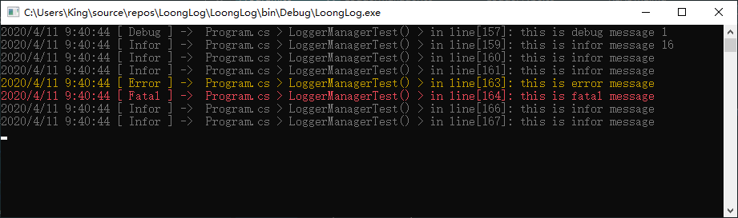
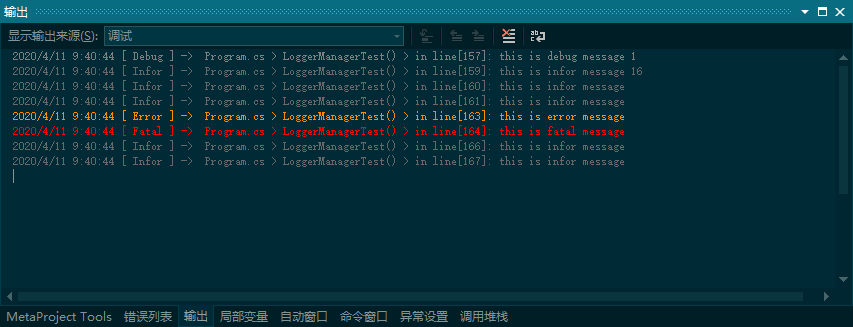
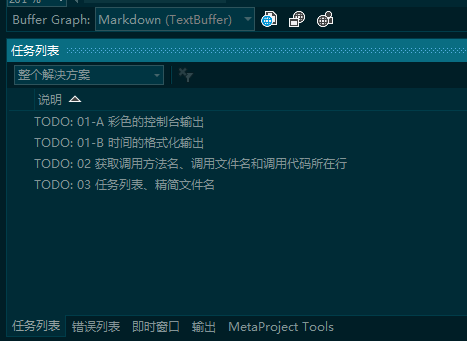
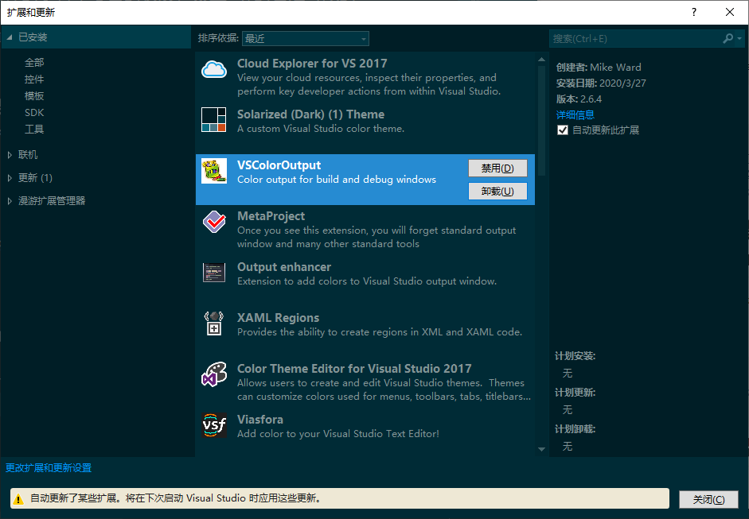
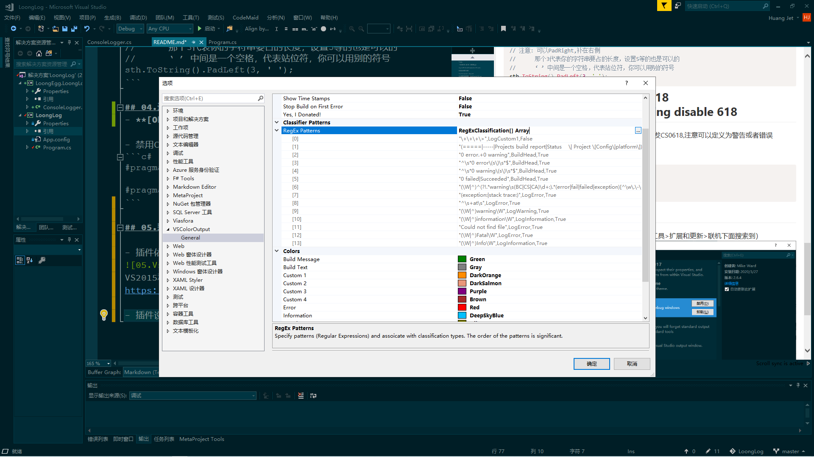
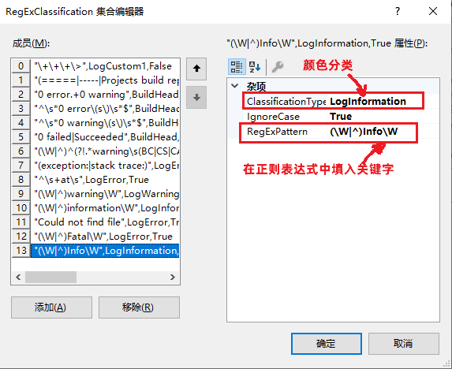
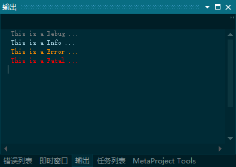

# LoongLog   
一个可以在控制台（彩色）、输出（彩色）、文件同时记录的Log日志。   
A log for c#/WPF with colorful output/console and file recorder.   
你可以在提交历史中看到每一步的实现.  
You can learn every step in  history commit.

## 使用效果


---
## 01.控制台的彩色输出和时间格式化<br>Colorfull Console And Time Format

- Colorfull Console
```c#
// 输出一次蓝色
Console.ForegroundColor = ConsoleColor.Blue;
Console.WriteLine("This is blue...");
```
- Time Format
```c#
// 获取当前时间
var time = DateTime.Now;
Console.WriteLine($"Normal format: {time.ToString()}");

// 时间的格式化
Console.WriteLine($"Format string: {time.ToString("yyyy-MM-dd hh-mm-ss")}");
```
---
## 02.获取调用者的文件名、方法名和代码所在行<br>Get [CallerMemberName]/[CallerFilePath]/[CallerLineNumber]
### KeyPoints
- Using
```c#
using System.Runtime.CompilerServices;
```
- Attribute
```c#
public virtual bool WriteLine(
      string message,
      LogType type,
      bool isDetailMode,
      [CallerMemberName] string origin = null,
      [CallerFilePath] string callerFile = null,
      [CallerLineNumber] int codeLine = 0)
```
---
## 03.任务列表、精简文件名<br>ToDO List & Trimmed File Name
- ToDo List（任务列表）
```c#
// TODO 你要做的任务
```



- 精简文件名
```c#
Path.GetFileName(fullLongLongPath);
```
- 指定长度输出，不足补空格
```c#
// 注意: 可以PadRight,补在右侧
//      那个3代表你的字符串要占的长度，设置5等的也是可以的
//      ‘ ’ 中间是一个空格，代表站位符，你可以用别的符号
sth.ToString().PadLeft(3, ' ');
```

---
## 04.过期代码警告与禁用CS0618<br>[Obsolete] & pragma warning disable 618
- **[Obsolete]** 受到这个Attribute标注的方法会引发CS0618,注意可以定义为警告或者错误

- 禁用CS0618警告
```c#
#pragma warning disable 618
            logger.WriteLine();
#pragma warning restore 618
```
---
## 05.彩色的Debug输出

- 插件依赖VsColorOutput（可能只有2019能在工具>扩展和更新>联机下面搜索到）

VS2015和VS2017版的下载地址
https://marketplace.visualstudio.com/items?itemName=MikeWard-AnnArbor.VSColorOutput

- 插件设置(工具>选项>VSColorOutput)



- Debug输出语法
```c#
 Debug.WriteLine(" Debug ");
 Debug.WriteLine(" Error ");
 Debug.WriteLine(" Fatal ");
 Debug.WriteLine(" Info ");
```

---
## 06.接口与Linq ForEach()
>使用接口是为了更好的ForEach

### 1）新建一个消息类型枚举
```c#
/// <summary>
/// 日志消息类型定义
/// </summary>
public enum MessageType
{
    /// <summary>
    /// 调试信息
    /// </summary>
    Debug,

    /// <summary>
    /// 一般信息
    /// </summary>
    Info,
    
    /// <summary>
    /// 错误
    /// </summary>
    Error,

    /// <summary>
    /// 崩溃
    /// </summary>
    Fatal
}
```

### 2）新建一个Debug版的Logger
**注意枚举类型可以把枚举成员的名字转换成字符串的，可以有效避免魔幻数**
```c#
/// <summary>
/// Debug版的Logger
/// </summary>
public class DebugOutputLogger
{
    /// <summary>
    /// 打印一条新的消息
    /// </summary>
    ///     <param name="type">消息类型</param>
    ///     <param name="message">消息内容</param>
    ///     <param name="callerName">调用的方法的名字</param>
    ///     <param name="path">调用方法所在的文件名</param>
    ///     <param name="line">调用的代码所在行</param>
    /// <returns>[true]->打印成功</returns>
    public bool WriteLine(
        MessageType type,
        string message,
        [CallerMemberName] string callerName = null,
        [CallerFilePath] string path = null,
        [CallerLineNumber] int line = 0) {

        string msg =
            DateTime.Now.ToString()
            + $" [ {type.ToString()} ] -> "  
            + $"{Path.GetFileName(path)} > {callerName}() > in line [{line.ToString().PadLeft(3, ' ')}]: "
            + message;

        Debug.WriteLine(msg);

        return true;
    }
}
```

### 3）不使用接口时的迭代
**注意那个运算符```?.```如果前面的表达式为null不会执行后面的命令**
```c#
        /// <summary>
        /// TODO: 06.接口与Linq ForEach()
        /// </summary>
        static void InterfaceForEachTest() {
            ConsoleLogger console = new ConsoleLogger();
            DebugOutputLogger debug = new DebugOutputLogger();

            List<Object> loggers = new List<object>
            {
                console,
                debug
            };

            loggers.ForEach(
                log => 
                {
                    (log as ConsoleLogger)?.WriteLine(MessageType.Info, "一个新的消息");
                    (log as DebugOutputLogger)?.WriteLine(MessageType.Info, "一个新的消息");                        
                }
            );
        }
```

### 4）使用接口时的迭代
```c#
// 使用接口
List<ILogger> iloggers = new List<ILogger>
{
    console,
    debug
};

iloggers.ForEach(
    log => log.WriteLine(MessageType.Info, "一个新的消息", "Method" , "file", 0));
```
---
## 07.创建BaseLogger抽象基类和DebugOutputLogger的完成
>可以取消各个Logger对ILogger接口的继承
### KeyPoint
- abstract修饰的类不可以被实例化
- abstract修饰的方法基类只需要提供签名，子类必须实现

### 1)创建Logger的级别定义LoggerLevel
```c#
    /// <summary>
    ///     Logger的级别定义 
    /// </summary>
    /// <remarks>
    ///     只有<seealso cref="MessageType"/> >= <seealso cref="LoggerLevel"/> 的时候新的消息才会被记录
    /// </remarks>
    public enum LoggerLevel
    {
       /// <summary>
        /// 调试级
        /// </summary>
        Debug,

        /// <summary>
        /// 一般级
        /// </summary>
        Info,
        
        /// <summary>
        /// 错误级
        /// </summary>
        Error,

        /// <summary>
        /// 崩溃级
        /// </summary>
        Fatal
    }
```

### 2)创建BaseLogger
BaseLogger主要提供的功能
- Logger级别的属性
- 默认构造器
- proteced修饰的
- 抽象的WriteLine()方法
```c#
    // TODO: 07-B BaseLogger
    /// <summary>
    /// 所有Logger的基类，提供了格式化输出log日志的基本方法
    /// </summary>
    public abstract class BaseLogger
    {
        /// <summary>
        /// Logger的级别定义，默认为<see cref="LoggerLevel.Debug"/>
        /// </summary>
        public LoggerLevel Level { get; private set; } = LoggerLevel.Debug;

        /// <summary>
        /// 默认构造器
        /// </summary>
        public BaseLogger(LoggerLevel level) {
            this.Level = level;
        }

        /// <summary>
        /// 格式化并返回日志消息
        /// </summary>
        ///     <param name="type">消息类型</param>
        ///     <param name="message">消息的具体内容</param>
        ///     <param name="isDetailMode">详细模式？</param>
        ///     <param name="callerName">调用方法的名字</param>
        ///     <param name="file">调用的文件名</param>
        ///     <param name="line">调用代码所在行</param>
        /// <returns>格式化后的日志消息</returns>
        public static string FormatMessage(
            MessageType type,
            string message,
            bool isDetailMode,
            string callerName,
            string file,
            int line) {

            StringBuilder msg = new StringBuilder();
            msg.Append(DateTime.Now.ToString() + " ");
            msg.Append($"[ {type.ToString()} ] -> ");

            if (isDetailMode)  
                msg.Append($" {Path.GetFileName(file)} > {callerName}() > in line[{line}]: "); 

            msg.Append(message); 
            return msg.ToString();
        }

        /// <summary>
        ///     让子类实现这个打印log的方法
        /// </summary>
        ///     <param name="fullMessage">完整的消息</param>
        ///     <param name="type">消息类型</param>
        /// <returns>[true]->打印成功</returns>
        public abstract bool WriteLine(string fullMessage, MessageType type);
    }
```

### 3)完成Debug版的logger
```c#
    /// <summary>
    /// Debug版的Logger
    /// </summary>
    public class DebugOutputLogger : BaseLogger, ILogger
    {
        /// <summary>
        /// 打印一条新的消息
        /// </summary>
        ///     <param name="type">消息类型</param>
        ///     <param name="message">消息内容</param>
        ///     <param name="callerName">调用的方法的名字</param>
        ///     <param name="path">调用方法所在的文件名</param>
        ///     <param name="line">调用的代码所在行</param>
        /// <returns>[true]->打印成功</returns>
        public bool WriteLine(
            MessageType type,
            string message,
            [CallerMemberName] string callerName = null,
            [CallerFilePath] string path = null,
            [CallerLineNumber] int line = 0) {

            string msg =
                DateTime.Now.ToString()
                + $" [ {type.ToString()} ] -> "  
                + $"{Path.GetFileName(path)} > {callerName}() > in line [{line.ToString().PadLeft(3, ' ')}]: "
                + message;

            Debug.WriteLine(msg);

            return true;
        }

        // TODO: 07-C Debug版的Logger的完成
        /// <summary>
        /// <see cref="BaseLogger.BaseLogger(LoggerLevel)"/>
        /// </summary> 
        public DebugOutputLogger(LoggerLevel level = LoggerLevel.Debug)  : base(level) { }

        /// <summary>
        /// <see cref="BaseLogger.WriteLine(string, MessageType)"/>
        /// </summary> 
        public override bool WriteLine(string fullMessage, MessageType type) {
            Debug.WriteLine(fullMessage);
            return true;
        }
    }
```

### 4)使用Debug版的Logger
```c#
        /// <summary>
        /// TODO: 07-D 完整DebugOutputLogger的使用
        /// </summary>
        static void DebugOutputLoggerCompleted() {
            DebugOutputLogger logger = new DebugOutputLogger();

            logger.WriteLine($" This is a {MessageType.Debug} ...", MessageType.Debug);
            logger.WriteLine($" This is a {MessageType.Info} ...", MessageType.Info);
            logger.WriteLine($" This is a {MessageType.Error} ...", MessageType.Error);
            logger.WriteLine($" This is a {MessageType.Fatal} ...", MessageType.Fatal);
        }
```


---
## 08.ConsoleLogger完结

### 1）继承并实现BaseLogger
```c#
using System;
using System.IO;
using System.Runtime.CompilerServices;

namespace LoongEgg.LoongLogger
{
    /* 
	| WeChat: InnerGeek
	| LoongEgg@163.com 
	| https://github.com/loongEgg/LoongLog
	*/

    /// <summary>
    /// 控制台版的Logger
    /// </summary>
    public class ConsoleLogger : BaseLogger, ILogger
    { 
        
        // TODO: 08-A 构造器
        public ConsoleLogger(LoggerLevel level = LoggerLevel.Debug) : base(level) { }

        // TODO: 08-B 实现抽象类BaseLogger的WriteLine()方法
        /// <summary>
        /// <see cref="BaseLogger.WriteLine(string, MessageType)"/>
        /// </summary> 
        public override bool WriteLine(string fullMessage, MessageType type) {
            if ((int)type < (int)Level)
                return false;

            var oldColor = Console.ForegroundColor;

            switch (type) {
                case MessageType.Debug:
                    Console.ForegroundColor = ConsoleColor.Gray;
                    break;

                case MessageType.Info:
                    Console.ForegroundColor = ConsoleColor.DarkCyan;
                    break;

                case MessageType.Error:
                    Console.ForegroundColor = ConsoleColor.Yellow;
                    break;

                case MessageType.Fatal:
                    Console.ForegroundColor = ConsoleColor.Red;
                    break; 
            }

            Console.WriteLine(fullMessage);
            Console.ForegroundColor = oldColor;
            return true;
        }
    }
}

``` 

### 2)使用ConsoleLogger
```c#
        /// <summary>
        /// TODO: 08-C 完整的ConsoleLogger的使用
        /// </summary>
        static void ConsoleLoggerCompleted() {
            ConsoleLogger logger = new ConsoleLogger();

            logger.WriteLine($"This is a Debug message", MessageType.Debug);
            logger.WriteLine($"This is a Info message", MessageType.Info);
            logger.WriteLine($"This is a Error message", MessageType.Error);
            logger.WriteLine($"This is a Fatal message", MessageType.Fatal);
        }
```
---
## 09.Logger调度管理器
### 1）生成Logger类型枚举
**注意这个[Flags]**
```c#
    // TODO: 09-A
    /// <summary>
    /// Logger实例的类型 
    /// </summary>
    /// <remarks>
    ///     // 注意加了[Flags]可以将枚举视为位域（即可以用 | 来OR运算）
    ///     // 示例代码使用的是16进制
    ///     LoggerType.Debug | LoggerType.Console // 表示 0x0001 | 0x0010 = 0x0011 (同时使能Debug和Console版的Logger)
    /// </remarks>
    [Flags]
    public enum LoggerType
    {
         Debug  = 0x0001, // 或者使用1， 即二进制的0001

         Console= 0x0010, // 或者使用2， 即二进制的0010

         File   = 0x0100  // 或者使用4， 即二进制的0100
    }
```
### 3) LoggerManager的实现
```c#
using System;
using System.Collections.Generic;
using System.Linq;
using System.Runtime.CompilerServices;

/* 
 | 个人微信：InnerGeeker
 | 联系邮箱：LoongEgg@163.com 
 | 创建时间：2020/4/10 23:37:38
 | 主要用途：
 | 更改记录：
 |			 时间		版本		更改
 */
namespace LoongEgg.LoongLogger
{
    /// <summary>
    /// Logger调度器
    /// </summary>
    public static class LoggerManager
    {
        static List<BaseLogger> Loggers = new List<BaseLogger>();

        // TODO: 09-B 注册Logger
        /// <summary>
        /// 使能各个Logger
        /// </summary>
        /// <param name="type">需要开启的Logger类型，可以使用“|”位域操作</param>
        /// <param name="level">开启的Logger的级别</param>
        /// <example>
        ///     // 开启调试输出和控制台的Logger，消息级别为Error
        ///     LoggerManager.Enable(LoggerType.Debug | LoggerType.Console,  LoggerLevel.Error);
        /// </example>
        public static void Enable(LoggerType type, LoggerLevel level = LoggerLevel.Debug) {
            Loggers.Clear();

            if (type.HasFlag(LoggerType.Console))
                Loggers.Add(new ConsoleLogger(level));

            if (type.HasFlag(LoggerType.Debug))
                Loggers.Add(new DebugLogger(level));

            if (type.HasFlag(LoggerType.File))
                throw new NotImplementedException();
        }

        // TODO: 09-C 销毁Logger
        /// <summary>
        /// 销毁所有的Logger
        /// </summary>
        public static void Disable() {
            Loggers.Clear();
        }

        // TODO: 09-D 打印日志 WriteDebug, WriteInfo, WriteError, WriteFatal
        /// <summary>
        /// 打印一条新的日志消息
        /// </summary>
        ///     <param name="type">消息类型</param>
        ///     <param name="message">消息的具体内容</param>
        ///     <param name="isDetailMode">详细模式？</param>
        ///     <param name="callerName">调用的方法的名字</param>
        ///     <param name="fileName">调用方法所在的文件名</param>
        ///     <param name="line">调用代码所在行</param>
        /// <returns>[true]->打印成功</returns>
        private static bool WriteLine
            (
                MessageType type,
                string message,
                bool isDetailMode,
                string callerName,
                string fileName,
                int line
            ) {

            string msg = BaseLogger.FormatMessage(type, message, isDetailMode, callerName, fileName, line);
            bool isWrited = true;

            if (Loggers.Any())
                Loggers.ForEach( logger => isWrited &= logger.WriteLine(msg, type) );

            return isWrited;
        }

        public static bool WriteDebug
            (
                string message,
                bool isDetailMode = true,
                [CallerMemberName] string callerName = null,
                [CallerFilePath] string fileName = null,
                [CallerLineNumber]int line = 0
            )       => WriteLine(MessageType.Debug, message, isDetailMode, callerName, fileName, line);

        public static bool WriteInfor
            (
                string message,
                bool isDetailMode = true,
                [CallerMemberName] string callerName = null,
                [CallerFilePath] string fileName = null,
                [CallerLineNumber]int line = 0
            )       => WriteLine(MessageType.Infor, message, isDetailMode, callerName, fileName, line);

        public static bool WriteError
            (
                string message,
                bool isDetailMode = true,
                [CallerMemberName] string callerName = null,
                [CallerFilePath] string fileName = null,
                [CallerLineNumber]int line = 0
            )       => WriteLine(MessageType.Error, message, isDetailMode, callerName, fileName, line);

         public static bool WriteFatal
            (
                string message,
                bool isDetailMode = true,
                [CallerMemberName] string callerName = null,
                [CallerFilePath] string fileName = null,
                [CallerLineNumber]int line = 0
             )      => WriteLine(MessageType.Fatal, message, isDetailMode, callerName, fileName, line);

    }
}

```
### 3)使用方法
```c#
        /// <summary>
        /// TODO: 09-E Logger调度器的使用
        /// </summary>
        static void LoggerManagerTest() {

            LoggerManager.Enable(LoggerType.Console | LoggerType.Debug , LoggerLevel.Debug);

            LoggerManager.WriteDebug($"this is debug message {(int)LoggerType.Debug}");

            LoggerManager.WriteInfor($"this is infor message {(int)LoggerType.Console}");
            LoggerManager.WriteInfor($"this is infor message ");
            LoggerManager.WriteInfor($"this is infor message ");
            LoggerManager.WriteInfor($"this is infor message ");
            LoggerManager.WriteInfor($"this is infor message ");
            LoggerManager.WriteInfor($"this is infor message ");

            LoggerManager.WriteError("this is error message");
            LoggerManager.WriteFatal("this is fatal message");


            LoggerManager.WriteInfor($"this is infor message ");
            LoggerManager.WriteInfor($"this is infor message ");
            LoggerManager.WriteInfor($"this is infor message ");
            LoggerManager.WriteInfor($"this is infor message ");
            LoggerManager.WriteInfor($"this is infor message ");
            LoggerManager.WriteInfor($"this is infor message ");
            LoggerManager.WriteInfor($"this is infor message ");
            LoggerManager.WriteInfor($"this is infor message ");
            LoggerManager.WriteInfor($"this is infor message ");
            LoggerManager.WriteInfor($"this is infor message ");
            LoggerManager.WriteInfor($"this is infor message ");
            LoggerManager.WriteInfor($"this is infor message ");
            LoggerManager.WriteInfor($"this is infor message ");
            LoggerManager.WriteInfor($"this is infor message ");
            LoggerManager.WriteInfor($"this is infor message ");

            LoggerManager.Disable();
        }
```
## 10.FileLogger的实现
### KeyPoint
- 获取运行程序所在的完整根目录路径
- 创建文件夹
- 用StreamWrite创建文件， 并将字符串写入

### 1）完整代码
```c#
using System;
using System.IO;

/* 
 | 个人微信：InnerGeeker
 | 联系邮箱：LoongEgg@163.com 
 | 创建时间：2020/4/11 9:56:55
 | 主要用途：
 | 更改记录：
 |			 时间		版本		更改
 */
namespace LoongEgg.LoongLogger
{
    /// <summary>
    /// File版的<see cref="BaseLogger"/>
    /// </summary>
    public class FileLogger : BaseLogger
    { 
        /*-------------------------------------- Properties -------------------------------------*/
        // Logger文件所在的路径
        public string FilePath { get; private set ;} 

        /*------------------------------------- Constructors ------------------------------------*/
        /// <summary>
        /// FileLogger的构造器
        /// </summary>
        ///     <param name="filePath">文件完整路径，可以不填，默认生成在当前根目录/log/下</param>
        ///     <param name="level">logger记录的最低级别</param>
        public FileLogger(string filePath = null, LoggerLevel level = LoggerLevel.Debug) : base(level) {

            if (filePath == null) {

                // TODO: 10-A 获取程序运行的根目录
                string root = Environment.CurrentDirectory;

                // TODO: 10-B 创建Log文件夹
                if (! Directory.Exists(root + @"/log/")) {
                    Directory.CreateDirectory(root + @"/log/");
                }

                this.FilePath = root + @"/log/" + DateTime.Now.ToString("yyyy-MM-dd hh-mm-ss") + ".log";
            }
            else {
                this.FilePath = filePath;       
            }

            // TODO: 10-C 创建log文件
            using (StreamWriter writer = new StreamWriter(this.FilePath)) {
                writer.WriteLineAsync(BaseLogger.FormatMessage(MessageType.Infor, "Logger File is Created...", true, nameof(FileLogger), "Created by Constructor", 46));
            }
        }

        /*------------------------------------ Public Methods -----------------------------------*/
        /// <summary>
        /// <see cref="BaseLogger.WriteLine(string, MessageType)"/>
        /// </summary> 
        public override bool WriteLine(string fullMessage, MessageType type) {

            using (StreamWriter writer = new StreamWriter(this.FilePath, true)) {
                writer.WriteLineAsync(fullMessage);
            }

            return true;
        }
    }
}

```

### 2)使用方法
```c#
        /// <summary>
        /// TODO: 10-D FileLogger的使用
        /// </summary>
        static void FileLoggerTest() {

            LoggerManager.Enable(LoggerType.Console | LoggerType.Debug | LoggerType.File, LoggerLevel.Debug);

            LoggerManager.WriteDebug($"this is debug message {(int)LoggerType.Debug}");

            LoggerManager.WriteInfor($"this is infor message {(int)LoggerType.Console}");
            LoggerManager.WriteInfor($"this is infor message ");
            LoggerManager.WriteInfor($"this is infor message "); 

            LoggerManager.WriteError("this is error message");
            LoggerManager.WriteFatal("this is fatal message");
             
            LoggerManager.WriteInfor($"this is infor message ");
            LoggerManager.WriteInfor($"this is infor message "); 

            LoggerManager.Disable();
        }
```